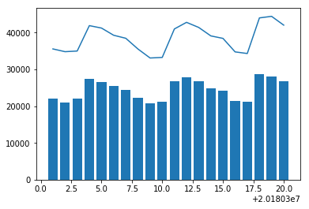
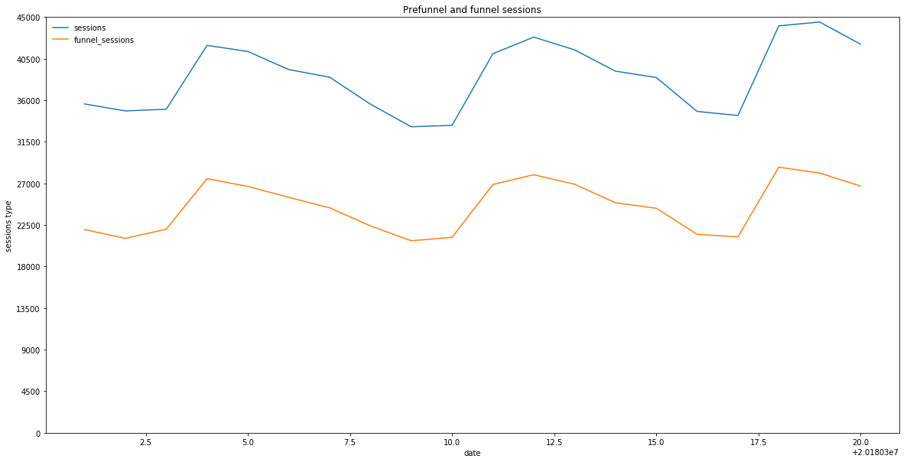
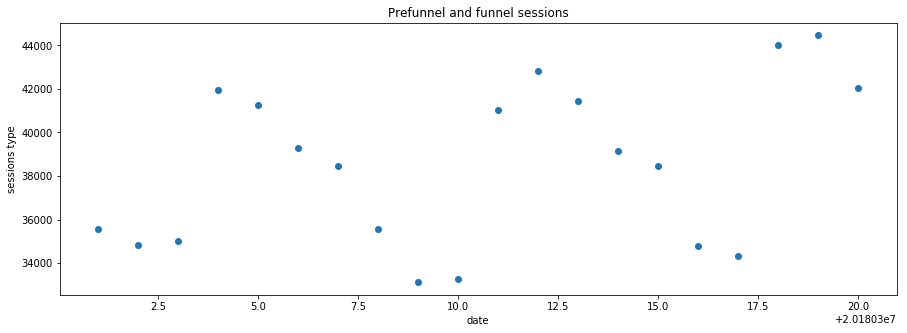
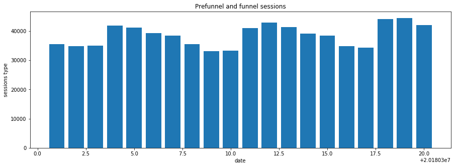

```python
%matplotlib inline
import pandas as pd
import sqlalchemy as sa
import numpy as np
import string
import yaml
import statsmodels.stats.api as sms
import plotly.plotly as py
import plotly.graph_objs as go
import matplotlib.pyplot as plt
import seaborn as sns
import os
import warnings
import plotly 
import plotly.offline as offline
import datetime
from scipy.stats.stats import spearmanr
from plotly import tools
from ggplot import *

offline.init_notebook_mode()

#ignore warnings for strings
warnings.filterwarnings("ignore")
```

    /Users/shumingpeh/anaconda3/lib/python3.6/site-packages/ggplot/utils.py:81: FutureWarning:
    
    pandas.tslib is deprecated and will be removed in a future version.
    You can access Timestamp as pandas.Timestamp
    
    IOPub data rate exceeded.
    The notebook server will temporarily stop sending output
    to the client in order to avoid crashing it.
    To change this limit, set the config variable
    `--NotebookApp.iopub_data_rate_limit`.


## Read dataset


```python
raw_data = pd.read_csv("../car-hire-projects/data/prefunnel_sessions.csv").drop(['Unnamed: 0'],1)
raw_data.head()
```


<div>
<style scoped>
    .dataframe tbody tr th:only-of-type {
        vertical-align: middle;
    }

    .dataframe tbody tr th {
        vertical-align: top;
    }

    .dataframe thead th {
        text-align: right;
    }
</style>
<table border="1" class="dataframe">
  <thead>
    <tr style="text-align: right;">
      <th></th>
      <th>date</th>
      <th>country</th>
      <th>which_device</th>
      <th>medium_grouped</th>
      <th>which_page_altered</th>
      <th>sessions</th>
      <th>funnel_sessions</th>
      <th>par</th>
    </tr>
  </thead>
  <tbody>
    <tr>
      <th>0</th>
      <td>20180301</td>
      <td>(not set)</td>
      <td>mobile_web</td>
      <td>affiliate</td>
      <td>homepage</td>
      <td>2</td>
      <td>1</td>
      <td>0.5</td>
    </tr>
    <tr>
      <th>1</th>
      <td>20180301</td>
      <td>(not set)</td>
      <td>mobile_web</td>
      <td>cpc</td>
      <td>landingpage</td>
      <td>1</td>
      <td>1</td>
      <td>1.0</td>
    </tr>
    <tr>
      <th>2</th>
      <td>20180301</td>
      <td>(not set)</td>
      <td>mobile_web</td>
      <td>organic</td>
      <td>homepage</td>
      <td>3</td>
      <td>3</td>
      <td>1.0</td>
    </tr>
    <tr>
      <th>3</th>
      <td>20180301</td>
      <td>(not set)</td>
      <td>mobile_web</td>
      <td>organic</td>
      <td>landingpage</td>
      <td>2</td>
      <td>2</td>
      <td>1.0</td>
    </tr>
    <tr>
      <th>4</th>
      <td>20180301</td>
      <td>(not set)</td>
      <td>windows</td>
      <td>affiliate</td>
      <td>homepage</td>
      <td>5</td>
      <td>0</td>
      <td>0.0</td>
    </tr>
  </tbody>
</table>
</div>


```python
# total sessions, simple plotting
total_sessions = (
    raw_data
    .groupby(['date'])
    .agg({"sessions":"sum","funnel_sessions":"sum"})
    .reset_index()
)

total_sessions.head()
```


<div>
<style>
    .dataframe thead tr:only-child th {
        text-align: right;
    }

    .dataframe thead th {
        text-align: left;
    }

    .dataframe tbody tr th {
        vertical-align: top;
    }
</style>
<table border="1" class="dataframe">
  <thead>
    <tr style="text-align: right;">
      <th></th>
      <th>date</th>
      <th>sessions</th>
      <th>funnel_sessions</th>
    </tr>
  </thead>
  <tbody>
    <tr>
      <th>0</th>
      <td>20180301</td>
      <td>35588</td>
      <td>21992</td>
    </tr>
    <tr>
      <th>1</th>
      <td>20180302</td>
      <td>34836</td>
      <td>21041</td>
    </tr>
    <tr>
      <th>2</th>
      <td>20180303</td>
      <td>35015</td>
      <td>22032</td>
    </tr>
    <tr>
      <th>3</th>
      <td>20180304</td>
      <td>41930</td>
      <td>27499</td>
    </tr>
    <tr>
      <th>4</th>
      <td>20180305</td>
      <td>41266</td>
      <td>26666</td>
    </tr>
  </tbody>
</table>
</div>


```python
plt.plot(total_sessions.date,total_sessions.sessions)
plt.bar(total_sessions.date,total_sessions.funnel_sessions)
plt.show()
```





## setting defaults
- size
- ticks
- title


```python
plt.figure(figsize=(20,10))

plt.plot(total_sessions.date,total_sessions.sessions)
plt.plot(total_sessions.date,total_sessions.funnel_sessions)

plt.ylim(0,45000)
plt.legend(loc='upper left', frameon=False)
plt.xlabel("date")
plt.ylabel("sessions type")
plt.title("Prefunnel and funnel sessions")

plt.yticks(np.linspace(0,45000,11,endpoint=True))


plt.show()
```





## Having other plots
- scatter
- bar


```python
plt.figure(figsize=(15,5))

plt.scatter(total_sessions.date,total_sessions.sessions)
# plt.plot(total_sessions.date,total_sessions.funnel_sessions)

# plt.ylim(0,45000)
# plt.legend(loc='bottom left', frameon=False)
plt.xlabel("date")
plt.ylabel("sessions type")
plt.title("Prefunnel and funnel sessions")

# plt.yticks(np.linspace(0,45000,11,endpoint=True))

plt.show()
```





```python
plt.figure(figsize=(15,5))

plt.bar(total_sessions.date,total_sessions.sessions)
# plt.plot(total_sessions.date,total_sessions.funnel_sessions)

# plt.ylim(0,45000)
# plt.legend(loc='bottom left', frameon=False)
plt.xlabel("date")
plt.ylabel("sessions type")
plt.title("Prefunnel and funnel sessions")

# plt.yticks(np.linspace(0,45000,11,endpoint=True))

plt.show()
```





## Subplots


```python
plt.figure(figsize=(15,8))

plt.subplot(1, 3, 1)
plt.barh(total_sessions.date, total_sessions.sessions)
plt.title("example")

plt.subplot(1, 3, 2)
plt.barh(total_sessions.date, total_sessions.sessions)
plt.title("example")
plt.xticks(rotation=45)

plt.subplot(1, 3, 3)
plt.barh(total_sessions.date, total_sessions.sessions)
plt.title("example")
plt.xticks(rotation=45)


plt.tight_layout()

```


```python
# df_ = (
#     df.loc[df['event_index'] <= 20]
#     .groupby('event_index')
#     .agg(np.sum)
# )


fig, [ax1, ax2] = plt.subplots(2, figsize=(5, 10))

(total_sessions.funnel_sessions / total_sessions.sessions.sum()).plot(ax=ax1)
(total_sessions.funnel_sessions / total_sessions.sessions.sum()).plot(logy=True, ax=ax2)

ax1.set_title('Proportion of sessions at varying length of user timeline')
ax1.set_ylabel('Proportion of sessions')
ax1.set_xlabel('Touchpoint index on user timeline')
ax2.set_title('Proportion of sessions at varying length of user timeline (log scale)')

ax2.set_xlabel('Touchpoint index on user timeline (log)')
ax2.set_ylabel('Proportion of sessions');
```


## Using functions to plot out something


```python

def get_redirect_distribution(channelname='criteo-retargeting'):
    # function that looks at the proportion of sessions, conversions, and conversion rate for a specific channel.
    subset = df.loc[df.channel == channelname]
    fig, [ax1, ax2, ax3] = plt.subplots(3, figsize=(10,22))
    
    subset = subset.loc[subset.event_index < 15].reset_index()
    (
        subset.sessions / subset.sessions.sum()
    ).plot(kind='bar', title='distribution of sessions {}'.format(channelname), ax=ax1)
    (
        subset.conversions / subset.conversions.sum()
    ).plot(kind='bar', title='distribution of conversions {}'.format(channelname), ax=ax2)
    
    (
        subset.conversions / subset.sessions
    ).plot(kind='bar', title='conversion rate {}'.format(channelname), ax=ax3)
    ax3.legend(loc='best')
    return subset

```


```python
first="ghi"
second="yuyu"
f'abc {first} abc {second} abc'
```


    'abc ghi abc yuyu abc'


## ggplot


```python
# ggplot(genericdf.reset_index(), aes(x='whichdate', weight = 'retentionrate',fill='whichdate')) + geom_bar(stat='identity') + ggtitle("Overall Retention, main sources")
```


```python
rawdata = (
    pd.read_csv("../RGT-exploratory-data-analysis/data/peak_hour_of_day.csv")
    .pipe(lambda x:x.assign(category=np.where(
        x.year == 2016, 'first', np.where(x.year == 2017, 'second', 'third'))
    )))
```


```python
rawdata.head()

```


<div>
<style scoped>
    .dataframe tbody tr th:only-of-type {
        vertical-align: middle;
    }

    .dataframe tbody tr th {
        vertical-align: top;
    }

    .dataframe thead th {
        text-align: right;
    }
</style>
<table border="1" class="dataframe">
  <thead>
    <tr style="text-align: right;">
      <th></th>
      <th>country</th>
      <th>year</th>
      <th>month</th>
      <th>hour</th>
      <th>is_30</th>
      <th>num_users</th>
      <th>category</th>
    </tr>
  </thead>
  <tbody>
    <tr>
      <th>0</th>
      <td>HK</td>
      <td>2016.0</td>
      <td>1.0</td>
      <td>0.0</td>
      <td>first_half</td>
      <td>1449</td>
      <td>first</td>
    </tr>
    <tr>
      <th>1</th>
      <td>HK</td>
      <td>2016.0</td>
      <td>1.0</td>
      <td>0.0</td>
      <td>second_half</td>
      <td>1799</td>
      <td>first</td>
    </tr>
    <tr>
      <th>2</th>
      <td>HK</td>
      <td>2016.0</td>
      <td>1.0</td>
      <td>1.0</td>
      <td>first_half</td>
      <td>1890</td>
      <td>first</td>
    </tr>
    <tr>
      <th>3</th>
      <td>HK</td>
      <td>2016.0</td>
      <td>1.0</td>
      <td>1.0</td>
      <td>second_half</td>
      <td>2005</td>
      <td>first</td>
    </tr>
    <tr>
      <th>4</th>
      <td>HK</td>
      <td>2016.0</td>
      <td>1.0</td>
      <td>2.0</td>
      <td>first_half</td>
      <td>2196</td>
      <td>first</td>
    </tr>
  </tbody>
</table>
</div>


```python
g = ggplot(rawdata.query("country == 'HK'"), aes(x='hour',y='num_users',color='category')) +\
geom_line() + facet_wrap("month") + theme(plot_margin = dict(right = 10, top=3))
g
```


```python
ggplot(rawdata.query("country == 'HK'"), aes(x='hour', weight = 'num_users',fill='category')) +\
geom_bar(stat='identity') + facet_wrap('month')
```


    ---------------------------------------------------------------------------

    AttributeError                            Traceback (most recent call last)

    ~/anaconda3/lib/python3.6/site-packages/IPython/core/formatters.py in __call__(self, obj)
        691                 type_pprinters=self.type_printers,
        692                 deferred_pprinters=self.deferred_printers)
    --> 693             printer.pretty(obj)
        694             printer.flush()
        695             return stream.getvalue()


    ~/anaconda3/lib/python3.6/site-packages/IPython/lib/pretty.py in pretty(self, obj)
        378                             if callable(meth):
        379                                 return meth(obj, self, cycle)
    --> 380             return _default_pprint(obj, self, cycle)
        381         finally:
        382             self.end_group()


    ~/anaconda3/lib/python3.6/site-packages/IPython/lib/pretty.py in _default_pprint(obj, p, cycle)
        493     if _safe_getattr(klass, '__repr__', None) is not object.__repr__:
        494         # A user-provided repr. Find newlines and replace them with p.break_()
    --> 495         _repr_pprint(obj, p, cycle)
        496         return
        497     p.begin_group(1, '<')


    ~/anaconda3/lib/python3.6/site-packages/IPython/lib/pretty.py in _repr_pprint(obj, p, cycle)
        691     """A pprint that just redirects to the normal repr function."""
        692     # Find newlines and replace them with p.break_()
    --> 693     output = repr(obj)
        694     for idx,output_line in enumerate(output.splitlines()):
        695         if idx:


    ~/anaconda3/lib/python3.6/site-packages/ggplot/ggplot.py in __repr__(self)
        114 
        115     def __repr__(self):
    --> 116         self.make()
        117         # this is nice for dev but not the best for "real"
        118         if os.environ.get("GGPLOT_DEV"):


    ~/anaconda3/lib/python3.6/site-packages/ggplot/ggplot.py in make(self)
        631                 for ax, facetgroup in self.get_facet_groups(group):
        632                     for layer in self.layers:
    --> 633                         kwargs = self._prep_layer_for_plotting(layer, facetgroup)
        634                         if kwargs==False:
        635                             continue


    ~/anaconda3/lib/python3.6/site-packages/ggplot/ggplot.py in _prep_layer_for_plotting(self, layer, facetgroup)
        600                 fillcol_raw = self._aes['fill'][:-5]
        601                 fillcol = self._aes['fill']
    --> 602                 fill_levels = self.data[[fillcol_raw, fillcol]].sort(fillcol_raw)[fillcol].unique()
        603             else:
        604                 fill_levels = None


    ~/anaconda3/lib/python3.6/site-packages/pandas/core/generic.py in __getattr__(self, name)
       3079             if name in self._info_axis:
       3080                 return self[name]
    -> 3081             return object.__getattribute__(self, name)
       3082 
       3083     def __setattr__(self, name, value):


    AttributeError: 'DataFrame' object has no attribute 'sort'


